# EFAMS Project Plan

Phased roadmap for the EFAMS (Enterprise Facility / Asset Management System) monorepo. Phase 1 is done; Phases 2–6 are planned.

---

## Phase 1 (Done)

**Deliverables:** Nx monorepo; Angular 14 web app (web-dashboard) and Ionic mobile app (mobile-field); Bootstrap + SCSS; Capacitor Android; .NET 6 API skeleton (api-asset); Jest for frontend unit tests; Cypress E2E.

---

## Phase 2: CI/CD and Data Layer

**Goal:** Azure DevOps pipeline, SQL Server usage, and API that uses it.

**Deliverables:**

- **Azure DevOps:** Add `azure-pipelines.yml` at repo root (or under `.azure/`). Pipeline: Node job (install, Nx lint/test/build for affected apps), .NET job (build api-asset). Optionally run on push to `main` with GitHub as source.
- **SQL Server:** Use SQL Server (local or container) for api-asset. Add EF Core or Dapper; one domain entity (e.g. Asset/Facility), migrations, and at least one query + simple index for performance.
- **api-asset:** One or two GET endpoints that read from SQL Server; keep .NET 6 and clean separation (e.g. Controllers, services, data access).
- **Technical artefacts:** Add a short design/architecture doc (e.g. in `docs/`) and keep the API spec (OpenAPI/Swagger) up to date.

---

## Phase 3: Microservices, Containers, and Messaging

**Goal:** Containerization, message queue, and Redis caching.

**Deliverables:**

- **Docker:** Dockerfile(s) for api-asset and optionally for web-dashboard (or nginx serving static build). docker-compose for local run (API + SQL Server + Redis + RabbitMQ or Redis-only for simplicity).
- **Message queue + Redis:** Use RabbitMQ or Redis (or both): e.g. API publishes "AssetCreated" events; a small consumer or background job processes them. Add Redis caching for a read-heavy endpoint (e.g. "get asset by id").
- **Cloud-native:** Document or demonstrate scaling/health (e.g. readiness/liveness if running in containers). Optional: deploy one service to Azure App Service or run in AKS/container instance.

---

## Phase 4: Security and Identity (OWASP, OAuth 2, Keycloak)

**Goal:** Secure API and frontends; OAuth 2 and Keycloak.

**Deliverables:**

- **OWASP:** Apply secure coding practices: parameterized queries (no raw SQL concatenation), validation (input/output), HTTPS only, security headers (e.g. in API and/or reverse proxy). Add a short "Security" section in docs referencing OWASP Top 10 where applicable.
- **OAuth 2:** Protect api-asset with OAuth 2 (e.g. JWT bearer). Frontends (web-dashboard, mobile-field) obtain tokens and send them with API calls.
- **Keycloak:** Run Keycloak (e.g. Docker). Configure a realm, client for "efams"; use it as the OAuth 2 / OIDC provider for login and token issuance. Connect Angular/Ionic apps and api-asset to Keycloak.

---

## Phase 5: Testing and Observability (ELK, Backend Tests, Storybook)

**Goal:** Backend unit tests with xUnit + Moq, frontend Storybook, ELK for logging.

**Deliverables:**

- **Backend unit tests:** Add a test project for api-asset (xUnit or NUnit; Moq for mocks). Cover at least one service and one controller (e.g. WeatherForecast or new Asset service). Wire into pipeline (e.g. `dotnet test` in Azure DevOps).
- **Frontend Storybook:** Add Storybook for web-dashboard (and optionally mobile-field) using @nrwl/storybook. Create stories for 2–3 shared or key components.
- **ELK stack:** Run Elasticsearch + Logstash + Kibana (e.g. Docker Compose). Send api-asset and/or Nx build logs to Elasticsearch (e.g. via Serilog or file beat). One simple Kibana dashboard (e.g. errors or request counts).

---

## Phase 6: Reusable Web Components (StencilJS)

**Goal:** Reusable web components with StencilJS.

**Deliverables:**

- **StencilJS library:** New project (e.g. `libs/ui-components` or a dedicated Stencil project in the repo). Build 1–2 reusable components (e.g. `efams-button`, `efams-card`) that can be consumed by the Angular apps (Angular integration with Stencil).
- **Consumption:** Use these components in web-dashboard and/or mobile-field to prove reuse.

---

## Phase Overview (Mermaid)

```mermaid
flowchart LR
  subgraph p1 [Phase 1 Done]
    P1A[Nx Angular Ionic]
    P1B[Bootstrap SCSS]
    P1C[api-asset skeleton]
    P1D[Jest Cypress]
  end
  subgraph p2 [Phase 2]
    P2A[Azure DevOps CI/CD]
    P2B[SQL Server]
    P2C[API + data layer]
    P2D[Design docs API spec]
  end
  subgraph p3 [Phase 3]
    P3A[Docker Compose]
    P3B[Redis RabbitMQ]
    P3C[Cloud-native]
  end
  subgraph p4 [Phase 4]
    P4A[OWASP OAuth2]
    P4B[Keycloak]
  end
  subgraph p5 [Phase 5]
    P5A[xUnit Moq]
    P5B[Storybook]
    P5C[ELK]
  end
  subgraph p6 [Phase 6]
    P6A[StencilJS components]
  end
  p1 --> p2 --> p3 --> p4 --> p5 --> p6
```

---

## Suggested Order and Dependencies

- **Phase 2** first: CI/CD and SQL/API give a solid base.
- **Phase 3** next: Containers and messaging build on the API and data from Phase 2.
- **Phase 4** after: Auth and Keycloak are easier once API and run environment (e.g. Docker) exist.
- **Phase 5** in parallel or after Phase 4: Tests and ELK can be added incrementally.
- **Phase 6** last: StencilJS is independent and can be done when other phases are stable.

---

## Phase Summary

| #   | Area                                      | Phase        |
| --- | ----------------------------------------- | ------------ |
| 1   | Angular + Ionic, Nx, Bootstrap, SCSS       | 1            |
| 2   | .NET 6 API skeleton                       | 1            |
| 3   | SQL Server, data layer                    | 2            |
| 4   | Azure DevOps CI/CD                        | 2            |
| 5   | Technical artefacts (design, API spec)   | 2            |
| 6   | Docker, message queues, Redis caching     | 3            |
| 7   | Microservices, cloud-native              | 2, 3         |
| 8   | OWASP, OAuth 2, Keycloak                 | 4            |
| 9   | Backend unit tests (xUnit/Moq)            | 5            |
| 10  | Frontend Jest + Storybook                 | 1, 5         |
| 11  | ELK stack                                 | 5            |
| 12  | StencilJS reusable components             | 6            |

Completing Phases 2–6 delivers the full roadmap.
